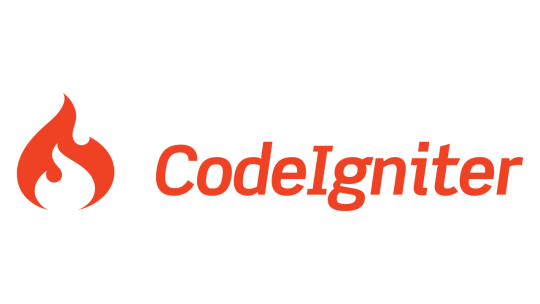

<p align="center">
  <a href="https://codeigniter.com" target="_blank">
    
  </a>
</p>

<p align="center">
  <a href="https://packagist.org/packages/codeigniter4/framework"></a>
  <a href="https://packagist.org/packages/codeigniter4/framework"></a>
  <a href="https://opensource.org/licenses/MIT"></a>
</p>

# Sistem Informasi Perpustakaan Digital

**"Membaca Lebih Mudah, Mengelola Lebih Cepat"**

Temukan kemudahan dalam mengelola data buku, kategori, dan penulis dalam satu sistem web modern.  
Aplikasi ini dirancang sebagai sistem **CRUD Perpustakaan berbasis CodeIgniter 4**, lengkap dengan **dashboard**, **autentikasi login**, dan **layout Bootstrap responsif**.

---

## Tentang Aplikasi

**Sistem Informasi Perpustakaan Digital** adalah aplikasi web berbasis **CodeIgniter 4** yang digunakan untuk mengelola data buku, kategori, dan penulis.  
Aplikasi ini dikembangkan untuk mendukung proses administrasi perpustakaan secara digital dengan antarmuka sederhana dan fungsional.

---

## Fitur Utama

- **Login & Logout** — Sistem autentikasi pengguna dengan validasi sesi.
- **Dashboard** — Menampilkan ringkasan jumlah buku, kategori, dan penulis.
- **Manajemen Buku** — CRUD lengkap (tambah, ubah, hapus, lihat detail).
- **Manajemen Kategori** — Kelola kategori buku agar lebih terorganisir.
- **Manajemen Penulis** — Kelola data penulis buku.
- **Layout Dinamis** — Header, footer, dan sidebar menggunakan Bootstrap.
- **Pencarian Data** — Fitur pencarian cepat di setiap tabel.
- **🧰 Database Seeder & Migration** — Struktur database otomatis dengan data awal.

---

## Screenshot Aplikasi

<p align="center">
  
</p>

<p align="center">
  
</p>

<p align="center">
  
</p>

<p align="center">
  
</p>

---

## Teknologi yang Digunakan

| Komponen               | Teknologi                          |
| ---------------------- | ---------------------------------- |
| **Framework**          | CodeIgniter 4                      |
| **Frontend**           | HTML, CSS, Bootstrap 5, JavaScript |
| **Database**           | MySQL                              |
| **Bahasa Pemrograman** | PHP 8.1+                           |
| **Version Control**    | Git & GitHub                       |

---

## Cara Menjalankan Aplikasi (Localhost)

### Clone Repository

```bash
git clone https://github.com/username/perpustakaan-ci4.git
```
